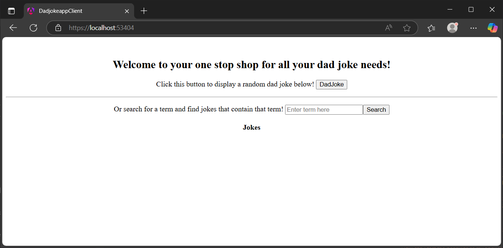
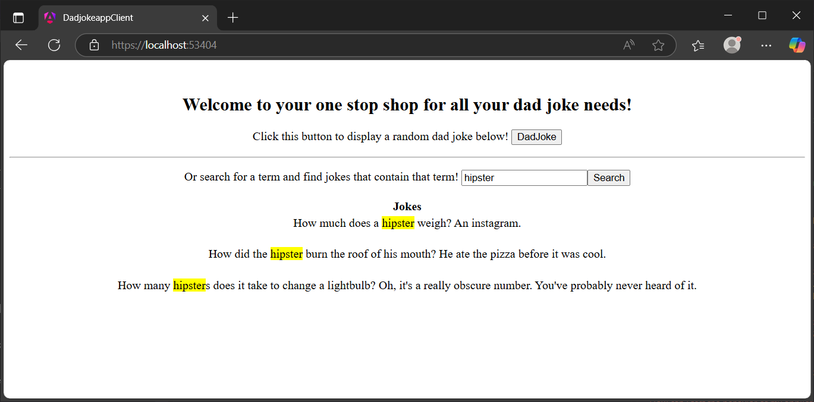
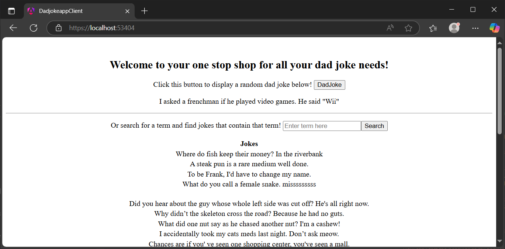
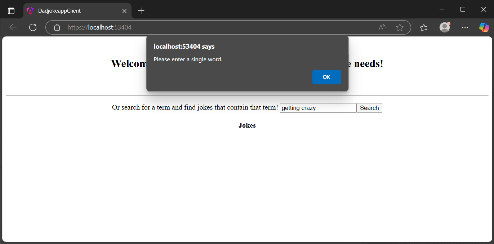

# DadJokeApp

This is a simple web application that fetches random dad jokes from the [icanhazdadjoke](https://icanhazdadjoke.com/) API and displays them on a web page.   
The application is built using C#/.NET for the back end and Angular for the front end. You can start the project by running the `DadJokeApp.sln` solution file in Visual Studio. or manually via command line.   

I considered utilizing docker to set up a container for the application, but in the interest of time and simplicity I opted to use the default launchers.

When launched, you will be greeted with the landing page   
   

Once there, you can click the "Get a Dad Joke" button to fetch a random dad joke from the API. The joke will be displayed on the page.  
   

If you want to search for jokes with a specific term in it, you can enter it in the search bar and click the search button to display jokes with that term.  
  
The term that you search will be highlighted in the list of jokes. The jokes will also be sorted in 3 groups depending on the length of the joke.  

If you click on the search button without entering a term, you will get the first 30 jokes from the API of any term.  
  

And if you enter more than one word in the search bar, you'll get a warning message.  
  

This was a neat project as it allowed me to test everything i've learned thus far about web programming practices in the back end and learn more about how
.NET interacts with the front end and in this case, Angular. It was a cool learning experience and I feel pretty happy with what I was able to put together.
